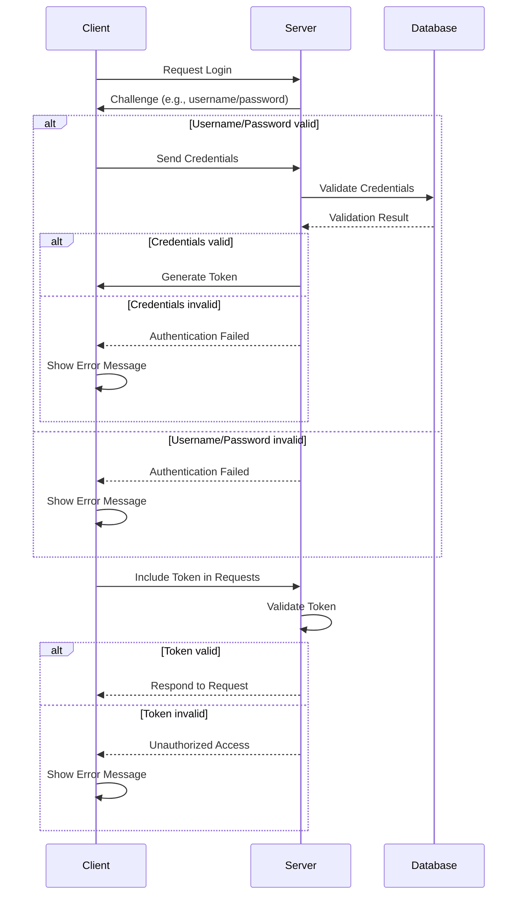

# Authentication

We must provides a authentication feature for the bank project.

First of all, we defines Users table to identify each user.

## Migration file: Up

See [migration file](../db/migration/000002_add_user.up.sql).

dbdiagram helps us generate these schema, but skip this time for the important.

Users tables of

```sql
CREATE TABLE "users" (
    "username" varchar PRIMARY KEY,
    "hashed_password" varchar NOT NULL, -- we MUST NOT store passwords directly. generally with solt
    "full_name" varchar NOT NULL,
    "email" varchar UNIQUE NOT NULL, -- to communicate with user
    "password_changed_at" timestamptz NOT NULL DEFAULT '0001-01-01 00:00:00Z',  -- it's recommended to rotate password in a certain period. default is very past time for ease develop.
    "created_at" timestamptz NOT NULL DEFAULT (now())
);
```

have a constraint between `accounts` of

```sql
ALTER TABLE "accounts" ADD FOREIGN KEY ("owner") REFERENCES "users" ("username");   -- acccounts.owner *->1 user.username
```

It means that there must be one `username` of `user` for each `owner` of `accounts`.

Additionally, a `user` can hold `account`s but their currency should differ.
To express that in db context, There're two ways.

First is creating a unique index.

```sql
CREATE UNIQUE INDEX ON "accounts" ("owner", "currency"); -- 
```

Second is adding a unique constraint.
Basically, it will automatically create **the same unique composite index as above**.

```sql
ALTER TABLE "accounts" ADD CONSTRAINT "owner_currency_key" UNIQUE ("owner", "currency");
```

However this migration will fail if some accounts entry already exist.
It will make the db dirty state, and down migration will be rejected.
We need to fix it by hand in such situation.

```
simple_bank=# select * from schema_migrations;          
 version | dirty 
---------+-------
       2 | t
(1 row)

simple_bank=# update schema_migrations set dirty = false;
UPDATE 1
simple_bank=# select * from schema_migrations;
 version | dirty 
---------+-------
       2 | f
(1 row)
```

Then we can `make migratedown` (the data will be lost) and now we can `make migrateup`.

## Migration file: Down

See [migration file](../db/migration/000002_add_user.down.sql).

We need to reverse operation of up.

First, drop constraint

```sql
ALTER TABLE IF EXISTS "accounts" DROP CONSTRAINT IF EXISTS "owner_currency_key"; -- defined in up
```

Second, `accounts` is

```
simple_bank=# \d accounts
                                       Table "public.accounts"
   Column   |           Type           | Collation | Nullable |               Default                
------------+--------------------------+-----------+----------+--------------------------------------
 id         | bigint                   |           | not null | nextval('accounts_id_seq'::regclass)
 owner      | character varying        |           | not null | 
 balance    | bigint                   |           | not null | 
 currency   | character varying        |           | not null | 
 created_at | timestamp with time zone |           | not null | now()
Indexes:
    "accounts_pkey" PRIMARY KEY, btree (id)
    "owner_currency_key" UNIQUE CONSTRAINT, btree (owner, currency)
    "accounts_owner_idx" btree (owner)
Foreign-key constraints:
    "accounts_owner_fkey" FOREIGN KEY (owner) REFERENCES users(username)
Referenced by:
    TABLE "entries" CONSTRAINT "entries_account_id_fkey" FOREIGN KEY (account_id) REFERENCES accounts(id)
    TABLE "transfers" CONSTRAINT "transfers_from_account_id_fkey" FOREIGN KEY (from_account_id) REFERENCES accounts(id)
    TABLE "transfers" CONSTRAINT "transfers_to_account_id_fkey" FOREIGN KEY (to_account_id) REFERENCES accounts(id)
```

have a constraint related to `user` of `"accounts_owner_fkey"` and so we need to drop it.

```sql
ALTER TABLE IF EXISTS "accounts" DROP CONSTRAINT IF EXISTS "accounts_owner_fkey";
```

Then, simply drop the table `users`.

## Add Queries

See [user.sql](../db/query/user.sql) and generated one.

There're some constraint and we need to modify [account.go](./account.go) like commit 9fad23b282b7419a85173759a2b71b6121288d29.
We can handle sql errors with more detail.

```go
if pqErr, ok := err.(*pq.Error); ok {
    switch pqErr.Code.Name() {
    case "foreign_key_violation", "unique_violation":
        ctx.JSON(http.StatusForbidden, errorResponse(err))
        return
    }
}
```

## Hashed Password

[Bcrypt](https://auth0.com/blog/hashing-in-action-understanding-bcrypt/) (Blowfish Cipher and Crypt for the password hash function of UNIX) often
used for password hashing management.

### Why Bcrypt?

- We must avoid to store naked password for clear security reasons
- There're some attacks like rainbow table now a days for the extreamly fast computation.

Bcrypt provides us a completely different output with [salt](https://en.wikipedia.org/wiki/Salt_(cryptography)) that used in hash iterations
even if the passwords themself are the same.

The format is as follows.

- First: Hash Algorism Identifier. 2A means bcrypt.
- Second: Cost means key expantion rounds. 10 means 2^10 = 1024 rounds.
- Third: 16bytes of salt used to calculate each iteration. (22 chars in [base64](https://base64.guru/learn/what-is-base64))
- Forth: 24 bytes of hash itself. (31 chars in base64)

```
$2A$10$NQO...16bytes...ADP4...24bytes...YW
 |  |          |                  |
ALG COST     SALT               HASH
```

The implementation in golang is https://github.com/golang/crypto/blob/master/bcrypt/bcrypt.go.

### Use bcrypt

Tips: According to https://stackoverflow.com/questions/61283248/format-errors-in-go-s-v-or-w, use `%w` for formatting error.

```
// returns the bcrypt hash of the password
func HashPassword(password string) (string, error) {
	hashedPassword, err := bcrypt.GenerateFromPassword([]byte(password), bcrypt.DefaultCost)
	if err != nil {
		return "", fmt.Errorf("failed to hash password %w", err)
	}
	return string(hashedPassword), nil
}

// returns the password is correct or not
func CheckPassword(password string, hashedPassword string) error {
	return bcrypt.CompareHashAndPassword([]byte(hashedPassword), []byte(password))
}
```

Then we can store it like [user.go](./user.go).

## Token-based Authentication

Token based authentication is basically

1. Client requests an access token (JWT, PASETO, ...) with username, password, ... and Server returns access token with its signature.
2. Client ask other requests with the access token and Server verifies it and responses to that.

The access token typically has lifetime duration and client can perform multiple operations within the duration.



### JWT

[Json Web Token](https://jwt.io/introduction/) is one of the access token.

JWT is composed of three part that

1. Header: algorithm and type like `{ "alg": "HS256", "typ": "JWT" }`
2. Payload: content to sign such as `{ "id": "..uuid..", "username": "...", "expired_at": "..unixtime or UTC and so on.." }`. It can include any value.
3. Sign: different for each signing algorithm like r, s, v of ECDSA or c (corresponding to d) of RSA

They're encoded with base64 and not **encrypted**.

### Signature algorithms

There're two types of algorithm. There're versions for output length of 256, 384 and 512

First is symmetric digital signature and both prover and verifier use the same key.
Suitable for local (or internal) usecase.

- HS256: [HMAC](https://en.wikipedia.org/wiki/HMAC)(Hash-based message authentication code) + [SHA256](https://en.wikipedia.org/wiki/SHA-2)(Secure Hash Algorithm).

Second is Asymmetric DSA and the keys are different to prove and verify.
Most popular schemes for web.

- RS256: [RSA](https://en.wikipedia.org/wiki/RSA_(cryptosystem)) [PKCS](https://ja.wikipedia.org/wiki/PKCS)v1.5 + SHA256 (Public Key Cryptography Standard).
- PS256: RSA [PSS](https://en.wikipedia.org/wiki/Probabilistic_signature_scheme) + SHA256 (Probabilistic Signature Scheme)
- ES256: [ECDSA](https://eprint.iacr.org/2020/1390.pdf) + SHA256

### Problem of JWT

JWT gives us many flexibilities but it's a cause.

1. Week Alg: It gives devs too many algorithms to choose and some of them have already been known to vulnerable.
    - RSA PKCSv1.5: padding oracle attack
    - ECDSA: invalid curve attack
2. Trivial forgery
    - set "alg" header to none.
    - set "alg" header to "HS256" though server normally verifies token with RSA (sign with their public key.)

### What is PASETO

Platform-Agnostic SEcurity TOken is a new standard for the verification. It also has 2 DSA.

1. Stronger algorithms
    - Devs don't have to choose the alg.
    - Only need to select the version of PASETO
    - Each version has strong cipher suite
    - Only 2 most recent PASTO versions are accepted
2. Non Trivial forgery
    - No "alg" header and "none" alg
    - Everything is authenticated
    - Encrypted Payload for symmetric DSA

The version 1 of PASETO is compatible with legacy system.
- symmetric DSA
    - authenticated encryption (with [AEAD](https://cloud.google.com/bigquery/docs/aead-encryption-concepts?hl=ja))
    - [AES256 CTR](https://crypto.stackexchange.com/questions/18538/aes256-cbc-vs-aes256-ctr-in-ssh) + HMAC SHA384
- asymmetric DSA
    - RSA PSS + SHA384

The version 2 is recommended one.
- symmetric DSA
    - authenticated encryption (with [AEAD](https://cloud.google.com/bigquery/docs/aead-encryption-concepts))
    - [XChaCha20-Poly1305](https://en.wikipedia.org/wiki/ChaCha20-Poly1305)
- asymmetric DSA
    - [Ed25519](https://en.wikipedia.org/wiki/EdDSA)

#### Structure of PASETO

- Version: Indicates the version of the PASETO token format being used. It helps define the structure and processing rules for the token. The version is typically represented as a single character, such as "v1" or "v2".
- Purpose: Describes the intended purpose or use case of the token. It provides semantic context to the token, indicating its purpose, such as "local" for local token use or "public" for public token use. The purpose helps determine how the token should be validated and processed.
- Payload: The payload part contains the actual data or claims of the token. It typically consists of a JSON object that holds various pieces of information relevant to the authentication or authorization process. The payload can include data such as user identification, expiration time, permissions, or any other relevant information needed for the token's purpose.
- Footer: The footer part is an optional part of the PASETO token structure represented for public data. It allows for adding additional information or metadata to the token, such as a digital signature or any other data that may be useful for verification or validation purposes.

## Implement in golang

See [token](../token/).
We use https://github.com/golang-jwt/jwt for JWT.

## Refresh Token

JWT and PASETO lifetime should be as short as possible because the token design is stateless and there's no way to revoke it when leaked.
However, its UX is bad.
New session management is refresh token.

Refresh token is stored on DB with `is_blocked` and used when the access token is expired.
Client send a re-new request with the refresh token.
It can be a random string and possible to use PASETO too.

## Resources

- https://bcrypt.online/
- https://en.wikipedia.org/wiki/Dictionary_attack
- https://base64.guru/learn/what-is-base64
- [SSL and TLS](https://www.youtube.com/watch?v=-f4Gbk-U758)
- https://en.wikipedia.org/wiki/EdDSA
- https://en.wikipedia.org/wiki/ChaCha20-Poly1305
- https://cloud.google.com/bigquery/docs/aead-encryption-concepts
- https://crypto.stackexchange.com/questions/18538/aes256-cbc-vs-aes256-ctr-in-ssh
