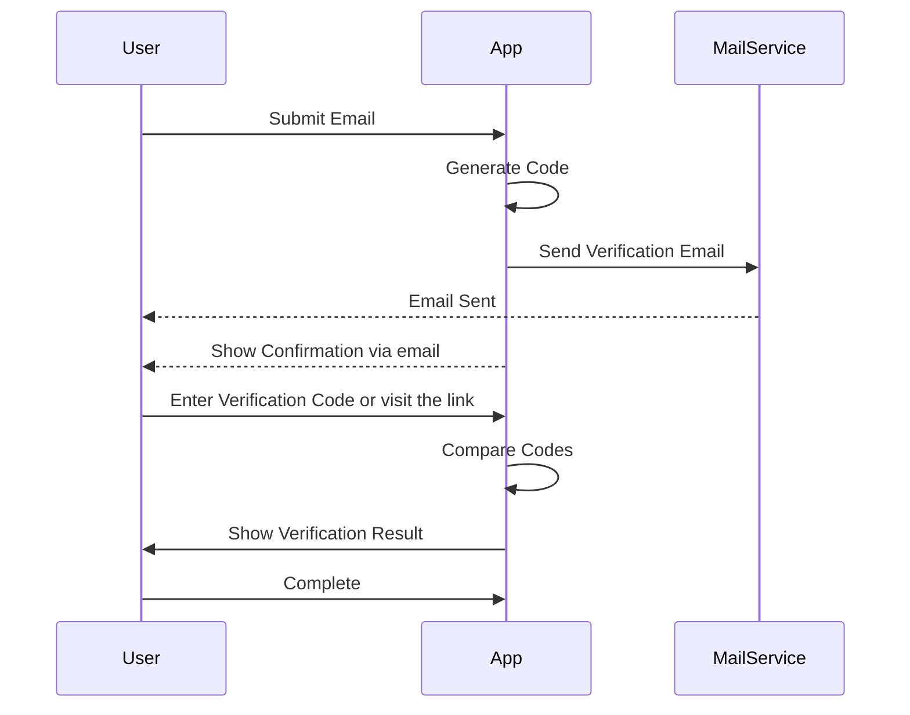

# Send Email in golang

There're [several ways](https://www.courier.com/guides/golang-send-email/) to send email.

- [net/smtp package](https://pkg.go.dev/net/smtp): std lib
- [gomail](https://github.com/go-gomail/gomail): a bit old
- [email](https://github.com/jordan-wright/email)
- [AWS SES](https://aws.amazon.com/ses/)

We need to setup [app password](https://support.google.com/accounts/answer/185833?hl=en) for gmail or
use [Gmail API](https://developers.google.com/gmail/api/guides?hl=en).

# Simple email verification

One way to verify user's email is to send an email with secret code:

